# Design Document: Factory Decoupling

## Overview

本设计将现有的单体 `MonsterFactory` 重构为三层工厂架构，实现关注点分离和更好的可维护性。

**架构层次：**
```
┌─────────────────────────────────────────────────────────┐
│                    MasterFactory                        │
│  (统一入口，协调所有专业工厂，提供向后兼容接口)            │
└─────────────────────────────────────────────────────────┘
                           │
        ┌──────────────────┼──────────────────┐
        ▼                  ▼                  ▼
┌───────────────┐  ┌───────────────┐  ┌───────────────┐
│ SlimeFactory  │  │ ZombieFactory │  │ DemonEyeFactory│
└───────────────┘  └───────────────┘  └───────────────┘
        │                  │                  │
        └──────────────────┼──────────────────┘
                           ▼
              ┌─────────────────────────┐
              │    BaseMonsterFactory   │
              │  (通用接口和辅助方法)     │
              └─────────────────────────┘
```

## Architecture

### 类图

```mermaid
classDiagram
    class IMonsterFactory {
        <<interface>>
        +supports(monsterId) bool
        +create(registry, monsterId, x, y, parentNode) EntityId
        +getConfig(monsterId) MonsterConfig*
    }
    
    class BaseMonsterFactory {
        <<abstract>>
        #_configs: map~string, MonsterConfig~
        #_configCache: ConfigCache*
        +supports(monsterId) bool
        +create(registry, monsterId, x, y, parentNode) EntityId
        +getConfig(monsterId) MonsterConfig*
        #attachCoreComponents(registry, entity, config, x, y)
        #attachPhysicsComponents(registry, entity, config)
        #attachRenderComponents(registry, entity, config, parentNode)
        #registerSpriteResource(config) string
        #loadConfigs(dirPath) int
    }
    
    class SlimeFactory {
        +supports(monsterId) bool
        +create(registry, monsterId, x, y, parentNode) EntityId
        -attachSlimeComponents(registry, entity, config)
        -attachKingSlimeComponents(registry, entity, config)
    }
    
    class ZombieFactory {
        +supports(monsterId) bool
        +create(registry, monsterId, x, y, parentNode) EntityId
        -attachZombieComponents(registry, entity, config)
    }
    
    class DemonEyeFactory {
        +supports(monsterId) bool
        +create(registry, monsterId, x, y, parentNode) EntityId
        -attachFlyingComponents(registry, entity, config)
    }
    
    class EaterFactory {
        +supports(monsterId) bool
        +create(registry, monsterId, x, y, parentNode) EntityId
        -attachCircleFlightComponents(registry, entity, config)
    }
    
    class AntlionFactory {
        +supports(monsterId) bool
        +create(registry, monsterId, x, y, parentNode) EntityId
        -attachAntlionComponents(registry, entity, config)
    }
    
    class VultureFactory {
        +supports(monsterId) bool
        +create(registry, monsterId, x, y, parentNode) EntityId
        -attachVultureComponents(registry, entity, config)
    }
    
    class KingSlimeFactory {
        +supports(monsterId) bool
        +create(registry, monsterId, x, y, parentNode) EntityId
        -attachKingSlimeComponents(registry, entity, config)
    }
    
    class MasterFactory {
        -_factories: vector~IMonsterFactory*~
        -_entityPool: MonsterEntityPool*
        -_configCache: ConfigCache*
        +getInstance() MasterFactory&
        +registerFactory(factory)
        +unregisterFactory(factory)
        +createMonster(registry, monsterId, x, y, parentNode) EntityId
        +createMonsterBatch(registry, monsterId, positions, parentNode) vector~EntityId~
        +preallocateEntities(registry, monsterId, count)
        +getAllSupportedMonsterIds() vector~string~
    }
    
    class ConfigCache {
        -_cache: map~string, MonsterConfig~
        -_loadedDirs: set~string~
        +getConfig(monsterId) MonsterConfig*
        +preloadDirectory(dirPath) int
        +clear()
        +isLoaded(monsterId) bool
    }
    
    class MonsterEntityPool {
        -_pools: map~string, vector~entt::entity~~
        -_activeCount: map~string, size_t~
        +preallocate(registry, monsterId, count)
        +acquire(registry, monsterId) entt::entity
        +release(registry, entity, monsterId)
        +getStatistics(monsterId) PoolStats
    }
    
    IMonsterFactory <|.. BaseMonsterFactory
    BaseMonsterFactory <|-- SlimeFactory
    BaseMonsterFactory <|-- ZombieFactory
    BaseMonsterFactory <|-- DemonEyeFactory
    BaseMonsterFactory <|-- EaterFactory
    BaseMonsterFactory <|-- AntlionFactory
    BaseMonsterFactory <|-- VultureFactory
    BaseMonsterFactory <|-- KingSlimeFactory
    MasterFactory o-- IMonsterFactory
    MasterFactory *-- ConfigCache
    MasterFactory *-- MonsterEntityPool
    BaseMonsterFactory --> ConfigCache
```



## Components and Interfaces

### 1. IMonsterFactory 接口

```cpp
// Classes/core/factory/monster/IMonsterFactory.h
class IMonsterFactory {
public:
    virtual ~IMonsterFactory() = default;
    
    // 检查是否支持指定怪物ID
    virtual bool supports(const std::string& monsterId) const = 0;
    
    // 创建怪物实体
    virtual ecs::EntityId create(entt::registry& registry,
                                 const std::string& monsterId,
                                 float x, float y,
                                 cocos2d::Node* parentNode) = 0;
    
    // 获取怪物配置
    virtual const MonsterConfig* getConfig(const std::string& monsterId) const = 0;
    
    // 获取支持的所有怪物ID
    virtual std::vector<std::string> getSupportedIds() const = 0;
};
```

### 2. BaseMonsterFactory 基类

```cpp
// Classes/core/factory/monster/BaseMonsterFactory.h
class BaseMonsterFactory : public IMonsterFactory {
public:
    virtual ~BaseMonsterFactory() = default;
    
    bool supports(const std::string& monsterId) const override;
    const MonsterConfig* getConfig(const std::string& monsterId) const override;
    std::vector<std::string> getSupportedIds() const override;

protected:
    // 配置加载
    int loadConfigs(const std::string& dirPath);
    bool loadSingleConfig(const std::string& filePath);
    
    // 通用组件附加方法（按优化顺序）
    void attachCoreComponents(entt::registry& registry, entt::entity entity,
                              const MonsterConfig& config, float x, float y);
    void attachPhysicsComponents(entt::registry& registry, entt::entity entity,
                                 const MonsterConfig& config);
    void attachRenderComponents(entt::registry& registry, entt::entity entity,
                                const MonsterConfig& config,
                                cocos2d::Node* parentNode);
    void attachCombatComponents(entt::registry& registry, entt::entity entity,
                                const MonsterConfig& config);
    
    // 精灵资源注册
    std::string registerSpriteResource(const MonsterConfig& config);
    
    // 配置存储
    std::unordered_map<std::string, MonsterConfig> _configs;
    
    // 怪物类型标识（子类设置）
    std::string _monsterType;
};
```

### 3. 专业工厂示例 - SlimeFactory

```cpp
// Classes/core/factory/monster/SlimeFactory.h
class SlimeFactory : public BaseMonsterFactory {
public:
    SlimeFactory();
    
    ecs::EntityId create(entt::registry& registry,
                         const std::string& monsterId,
                         float x, float y,
                         cocos2d::Node* parentNode) override;

private:
    void attachSlimeMovement(entt::registry& registry, entt::entity entity,
                             const MonsterConfig& config);
    void attachSpecialSlimeComponents(entt::registry& registry, entt::entity entity,
                                      const std::string& monsterId,
                                      const MonsterConfig& config);
    void attachKingSlimeComponents(entt::registry& registry, entt::entity entity,
                                   const MonsterConfig& config);
};
```

### 4. MasterFactory 总工厂

```cpp
// Classes/core/factory/MasterFactory.h
class MasterFactory {
public:
    static MasterFactory& getInstance();
    
    // 工厂注册
    void registerFactory(std::unique_ptr<IMonsterFactory> factory);
    void unregisterFactory(const std::string& factoryType);
    
    // 实体创建
    ecs::EntityId createMonster(entt::registry& registry,
                                const std::string& monsterId,
                                float x, float y,
                                cocos2d::Node* parentNode = nullptr);
    
    // 批量创建（使用缓存配置）
    std::vector<ecs::EntityId> createMonsterBatch(
        entt::registry& registry,
        const std::string& monsterId,
        const std::vector<cocos2d::Vec2>& positions,
        cocos2d::Node* parentNode = nullptr);
    
    // 对象池管理
    void preallocateEntities(entt::registry& registry,
                             const std::string& monsterId,
                             size_t count);
    
    // 配置管理
    void preloadConfigs(const std::string& dirPath);
    const MonsterConfig* getConfig(const std::string& monsterId) const;
    
    // 查询
    std::vector<std::string> getAllSupportedMonsterIds() const;
    bool isSupported(const std::string& monsterId) const;
    
    // 向后兼容（委托给 MonsterFactory 的旧接口）
    // 这些方法保持与旧 MonsterFactory 相同的签名

private:
    MasterFactory();
    
    IMonsterFactory* findFactory(const std::string& monsterId);
    
    std::vector<std::unique_ptr<IMonsterFactory>> _factories;
    std::unique_ptr<ConfigCache> _configCache;
    std::unique_ptr<MonsterEntityPool> _entityPool;
};
```

### 5. ConfigCache 配置缓存

```cpp
// Classes/core/factory/ConfigCache.h
class ConfigCache {
public:
    static ConfigCache& getInstance();
    
    // 获取配置（自动缓存）
    const MonsterConfig* getConfig(const std::string& monsterId);
    
    // 预加载目录
    int preloadDirectory(const std::string& dirPath);
    
    // 缓存管理
    void clear();
    bool isLoaded(const std::string& monsterId) const;
    size_t getCacheSize() const;

private:
    std::unordered_map<std::string, MonsterConfig> _cache;
    std::unordered_set<std::string> _loadedDirs;
    
    bool parseConfig(const std::string& filePath, MonsterConfig& config);
};
```

### 6. MonsterEntityPool 实体池

```cpp
// Classes/core/factory/MonsterEntityPool.h
class MonsterEntityPool {
public:
    struct PoolStats {
        size_t totalSize;
        size_t activeCount;
        size_t availableCount;
    };
    
    // 预分配
    void preallocate(entt::registry& registry,
                     const std::string& monsterId,
                     size_t count,
                     IMonsterFactory* factory);
    
    // 获取/归还
    entt::entity acquire(entt::registry& registry,
                         const std::string& monsterId);
    void release(entt::registry& registry,
                 entt::entity entity,
                 const std::string& monsterId);
    
    // 统计
    PoolStats getStatistics(const std::string& monsterId) const;
    
    // 清理
    void clear(entt::registry& registry);

private:
    void resetEntity(entt::registry& registry, entt::entity entity);
    void activateEntity(entt::registry& registry, entt::entity entity);
    void deactivateEntity(entt::registry& registry, entt::entity entity);
    
    std::unordered_map<std::string, std::vector<entt::entity>> _pools;
    std::unordered_map<std::string, std::vector<entt::entity>> _available;
    std::unordered_map<std::string, size_t> _activeCount;
};
```

## Data Models

### MonsterConfig 结构

保持现有的 `MonsterConfig` 结构不变，它已经是一个良好的数据模型。

### 组件附加顺序

为优化 EnTT 的缓存性能，组件按以下顺序附加：

```cpp
// 高频访问组件组（每帧都访问）
1. TransformComponent      // 位置信息
2. PhysicsBodyComponent    // 物理体
3. RenderComponent         // 渲染配置

// 中频访问组件组（AI/战斗系统访问）
4. EntityStateFlags        // 状态标记
5. HealthComponent         // 生命值
6. AggroComponent          // 仇恨

// 低频访问组件组（特定系统访问）
7. AnimationComponent      // 动画
8. ParentNodeComponent     // 父节点
9. GroundDetectorComponent // 地面检测（如需要）

// 类型特定组件（最后附加）
10. JumpMovementComponent / WarriorMovementComponent / etc.
11. ProjectileAttackComponent / SlowFallComponent / etc.
```

## Correctness Properties

*A property is a characteristic or behavior that should hold true across all valid executions of a system—essentially, a formal statement about what the system should do. Properties serve as the bridge between human-readable specifications and machine-verifiable correctness guarantees.*

### Property 1: Factory Support Consistency

*For any* monster ID and any Specialized_Factory, if `supports(monsterId)` returns true, then `create(monsterId)` SHALL return a valid entity (not INVALID_ENTITY), and if `supports(monsterId)` returns false, then `create(monsterId)` SHALL return INVALID_ENTITY.

**Validates: Requirements 1.2, 2.6, 2.7**

### Property 2: Master Factory Delegation

*For any* monster ID that is supported by at least one registered Specialized_Factory, calling `MasterFactory::createMonster(monsterId)` SHALL return a valid entity with all required components.

**Validates: Requirements 3.3**

### Property 3: Unsupported Monster Handling

*For any* monster ID that is not supported by any registered Specialized_Factory, calling `MasterFactory::createMonster(monsterId)` SHALL return INVALID_ENTITY.

**Validates: Requirements 3.4**

### Property 4: Factory Registration Effects

*For any* Specialized_Factory, after calling `MasterFactory::registerFactory(factory)`, all monster IDs returned by `factory.getSupportedIds()` SHALL be included in `MasterFactory::getAllSupportedMonsterIds()`. After calling `unregisterFactory()`, those IDs SHALL no longer be included.

**Validates: Requirements 3.5, 3.6**

### Property 5: Entity Pool Acquire-Release Invariant

*For any* monster type and entity pool, the invariant `totalSize == activeCount + availableCount` SHALL hold at all times. After `acquire()`, activeCount increases by 1 and availableCount decreases by 1 (or totalSize increases if pool was empty). After `release()`, activeCount decreases by 1 and availableCount increases by 1.

**Validates: Requirements 4.3, 4.5, 4.6**

### Property 6: Pool Acquire Always Succeeds

*For any* monster type, calling `acquire()` SHALL always return a valid entity, regardless of whether the pool has available entities (dynamic creation when empty).

**Validates: Requirements 4.3, 4.4**

### Property 7: Config Cache Idempotence

*For any* monster ID, calling `ConfigCache::getConfig(monsterId)` multiple times SHALL return equivalent MonsterConfig objects (same field values).

**Validates: Requirements 5.2, 5.3**

### Property 8: Backward Compatibility

*For any* monster ID that was supported by the original MonsterFactory, calling `MasterFactory::createMonster(monsterId)` SHALL produce an entity with the same set of components and equivalent component values as the original implementation.

**Validates: Requirements 7.2, 7.3, 7.4**

## Error Handling

### 配置加载错误

```cpp
// 配置文件不存在或解析失败
if (!loadSingleConfig(filePath)) {
    CCLOG("BaseMonsterFactory: Failed to load config: %s", filePath.c_str());
    // 继续加载其他配置，不中断
}
```

### 工厂查找失败

```cpp
// 没有工厂支持该怪物ID
IMonsterFactory* factory = findFactory(monsterId);
if (!factory) {
    CCLOG("MasterFactory: No factory supports monster ID: %s", monsterId.c_str());
    return ecs::INVALID_ENTITY;
}
```

### 实体池耗尽

```cpp
// 池为空时动态创建
if (_available[monsterId].empty()) {
    CCLOG("MonsterEntityPool: Pool exhausted for %s, creating new entity", 
          monsterId.c_str());
    return createNewEntity(registry, monsterId);
}
```

## Testing Strategy

### 单元测试

1. **BaseMonsterFactory 测试**
   - 测试 `loadConfigs()` 正确加载配置文件
   - 测试 `supports()` 对已加载配置返回 true
   - 测试辅助方法正确附加组件

2. **专业工厂测试**
   - 每个工厂测试其支持的所有怪物ID
   - 验证创建的实体包含正确的组件

3. **MasterFactory 测试**
   - 测试工厂注册/注销
   - 测试 `createMonster()` 委托到正确的工厂
   - 测试 `getAllSupportedMonsterIds()` 聚合

4. **ConfigCache 测试**
   - 测试缓存命中/未命中
   - 测试 `preloadDirectory()` 预加载
   - 测试 `clear()` 清空缓存

5. **MonsterEntityPool 测试**
   - 测试预分配
   - 测试获取/归还
   - 测试统计信息一致性

### 属性测试

使用 C++ 属性测试库（如 RapidCheck）实现以下属性测试：

1. **Property 1 测试**: 生成随机怪物ID，验证 supports/create 一致性
2. **Property 5 测试**: 随机执行 acquire/release 操作，验证统计不变量
3. **Property 7 测试**: 多次获取同一配置，验证等价性
4. **Property 8 测试**: 对比新旧工厂创建的实体组件

### 测试配置

```cpp
// 属性测试最少运行 100 次迭代
RC_GTEST_PROP(FactoryDecoupling, SupportCreateConsistency, ()) {
    // Feature: factory-decoupling, Property 1: Factory Support Consistency
    // ...
}
```

