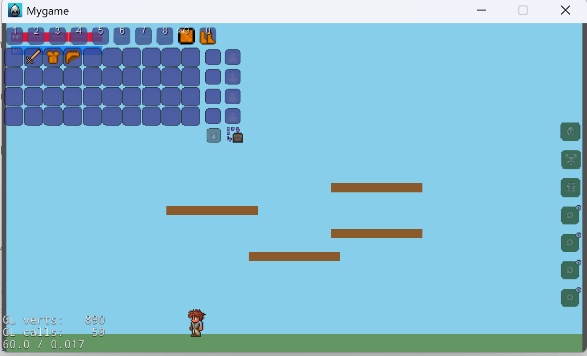

- Classes/items/InventoryDef.h：新增物品类型枚举、物品定义结构（id/name/type/maxStack/icon/value/tags）和运行时背包槽结构。
  - Classes/items/ItemManager.h/.cpp：新增物品管理器单例，现支持追加方式加载多份 JSON。初始化时依次尝试 items.json/items_blocks.json/items_machines.json/items_seeds.json，累计合并，缺失时提示日志；按 ID 提供定义查询和图标获取（SpriteFrame 缓存+文件兜底）。
  - Resources/items.json：添加示例物品数据（木头/石块/工作台）展示字段格式。
  - CMakeLists.txt：把新管理器源码/头文件加入编译列表。-----202512081404

SplashScene::init() 里临时插入自检：
  - 文件：Classes/SplashScene.cpp
  - 顶部加：#include "items/ItemManager.h"
  - 在 init() 末尾、return true; 前加入：
  auto mgr = ItemManager::getInstance();
  auto def = mgr->getItemData(101);
  if (def) {
      CCLOG("Item 101 loaded: %s stack=%d", def->name.c_str(), def->maxStack);
  } else {
      CCLOG("Item 101 not found");
  }
  auto frame = mgr->getItemSprite(101);
  CCLOG("Icon frame for 101: %s", frame ? "ok" : "null");

  运行游戏看日志，确保 items.json 被复制且 Resources/items/wood.png 存在（否则 Sprite 为 null）。测试完可以删除这段。------202512081429

  目前为 items 目录下面的 png 编写了对应的 json 文件
  ------202512081536

  - 实现了物品定义层：InventoryDef.h 定义 ItemType、ItemDefinition、InventorySlot。ItemManager 单例可加载多份 JSON（items.json/items_blocks.json/items_machines.json/items_seeds.json，追加合并）、按 ID 查询、获取图标（缓存+文件兜底），编译已接入 CMake。                                                                                     
  - 实现了背包实例层（2.2）：Inventory 单例，固定容量容器，接口 init/addItem/removeItem/getItemCount/clear，自动堆叠与空槽填充，遵守 maxStack，变更时派发 Event_InventoryChanged，已接入 CMake。
  - 生成了物品数据示例包 JSON：
      - Resources/items_blocks.json：6 个方块，type=5
      - Resources/items_seeds.json：若干种子，type=4
      - Resources/items_machines.json：1 个机器箱子，type=5，Workbench/Furnace 标记 tag 1/2 作为环境标记
      - 原示例 Resources/items.json 有基础占位物品
  - 测试指导：在场景中调用 ItemManager::getInstance()/Inventory::getInstance() 并用 CCLOG 验证加载和操作；日志在 VSCode Debug Console 或调试控制台输出。目前缺失对应 PNG 时会提示找不到图标。
    完成2.2,2.3部分内容，但是没有进行调试
    ----------202512081547

  按纲要完善了背包逻辑（容量默认50，溢出掉落，额外接口）：             
  - Classes/items/Inventory.h/.cpp 增强：                                                                                                
      - addItemWithOverflow(id,count)：尝试放入背包，放不下的部分以 InventorySlot{id,remaining,0} 形式返回，可用于生成掉落。              
      - swapSlots(a,b)、moveItem(from,to,count)（支持同类堆加/空格搬运/不同物品交换）、getFirstEmptySlot()。
      - 内部 helper addItemInternal 复用堆叠/空格分配逻辑；所有修改后派发事件 "Event_InventoryChanged"。                                
  - CMake 已编译 Inventory.cpp/Inventory.h。

  - 实现了物品背包逻辑层：InventoryDef 定义 Item/Slot，ItemManager 负责加载多份 items*.json，按 ID 查询与取图标，Inventory 固定 50 格，支持自动堆叠、溢出返回掉落列表、swap/move、首空格查询，变更派发 Event_InventoryChanged。                                          
  - 构建了 10×5 背包 UI：InventoryLayer（Classes/items/InventoryLayer.*）基于鼠标输入，显示图标与数量，悬停显示名称，左键拖拽交换/堆加，右键半分拆到首个空格，监听事件自动刷新。已纳入 CMake。
  - 生成了物品数据示例：Resources/items_blocks.json、items_seeds.json、items_machines.json（含工作台/熔炉标记 tag），原 items.json 有基座，图标需确保存在对应 PNG。
    --------202512081624

Classes/items 目录当前状态与进度（已修正编码，UTF-8 可读）：
                                                                                                                                 
  - InventoryDef.h：定义 ItemType、ItemDefinition、InventorySlot。                                                               
  - ItemManager：单例支持追加方式加载多份 JSON。初始化时依次尝试 items.json/items_blocks.json/items_machines.json/               
    items_seeds.json 并合并；缺失会日志提示。提供按 ID 查询与取图标（SpriteFrame 缓存+文件兜底）。                               
  - Inventory：单例，固定容量（默认 50），接口 init/addItem/addItemWithOverflow/removeItem/getItemCount/getFirstEmptySlot/       
    swapSlots/moveItem，堆叠/空格分配遵守 maxStack，变更派发 Event_InventoryChanged。                                            
  - InventoryLayer：10×5 背包 UI，显示图标/数量，悬停显示名称，左键拖拽交换/堆加，右键半分到首空格，监听事件自动刷新，已纳       
    入 CMake。                                                                                                                   
  - 数据示例：Resources/items_blocks.json、items_machines.json、items_seeds.json，原始示例 items.json（需确保对应 PNG 存在）。   
  - 调试说明：在场景中调用 ItemManager::getInstance()、Inventory::getInstance() 打日志验证加载与操作；缺失 PNG 会提示找不到图标。  - 构建提醒：曾有 WinMain 未解析是入口未编入；需确保 CMake 生成的工程包含 proj.win32/main.cpp。
  ——--------202512081838

  当前进度合并NPC分支，创建全物品测试案例
  -------202512081935
  

1.完成items测试，接下来正式构建全物品
2.分析每个文件的构成
3.正式搭建合成系统ing
4.重构物品系统
将素材分为4类
Equipment Materials Placeables Consumables

  -------202512101400

  - Classes/items/InventoryDef.h：物品类别枚举重构为 Equipment/Materials/Placeables/Consumables。
  - Classes/items/ItemManager.cpp/ItemManager.h：默认加载路径改为 items/items_json/*.json，新增旧类型值到新枚举的转换；加载失败提示指向新目录。
  - Classes/items/Inventory.h：默认容量改为 59（50 普通 + 4 钱币/弹药 + 1 丢弃 + 4 武器）。
  - Classes/items/InventoryLayer.cpp/InventoryLayer.h：物品栏根据实际容量计算行数；保持左上角占屏幕 1/4 的布局并自适应格子大小；新增 4 个钱币/弹药、1 个丢弃、4 个武器专用格，背景颜色与标签区分；点击检测仅覆盖实际 59 格。

使用entt库来重构物品系统，
修复UI框架的bug
重构物品框架这个部分

  -----20251211

全物品系统分类
修复bug，entt库不能使用中文表达
开始搭建合成系统纲要
初步设计合成系统UI
开始构思附魔系统
  ----20251212

完成合成系统的初步构建
处理物品栏中无法显示数字的问题
有可能出现0-9数字被遮挡的问题
不能使用中文来表示
尝试去除测试中通过点击按钮来达到的交互功能，
将其改为光标点击（OpenGL坐标系（原点在左下角），而不是屏幕坐标系。但是在某些平台（特别是Windows），鼠标事件可能返回的是屏幕坐标（原点在左上角），导致Y轴反转。 ）
  -----20251213

统一坐标轴
（处理光标坐标bug）
在物品栏中添加物品
1101,
    "name": "Copper Helmet",
id": 1102,
    "name": "Copper Chestplate",
处理显示物品名称bug
处理物品栏范围部分优化bug

  -----20251214

D:\test\Terraria_tj\Resources\items\items_json\items_materials.json
编号为3502+
依次递增
修改中文命名的钱币素材的名字为英文
新增配方在D:\test\Terraria_tj\Resources\items\items_json\recipes.json中添加钱币的合成配方，进率为100,
用手合成就行
100 铜  1银
100银   1金
100金   1铂金

1银    100铜
1金    100银
1铂金  100铜

-----20251214

合成功能UI设计改善，准备导入制作配方
设置基础的提示词，
背景设置：我现在在使用cocos引擎制作一款Terraria风格的2D像素风格游戏，我现在在做合成系统的构建，需求：我需要做物品素材：来作为物品栏中物品的填充
提交git
-----20251215

修复合成系统显示问题
改进合成系统UI设计，将UI设计改为可以正确显示的

-----20251215

新增四种木材（木材，针叶木，棕榈木，红木），放在material
的woods中ID，3506+
新增门，木平台，火把放在placeables类的woodware中
ID，2120+
新增配方如下：
1 木材 → 2 平台    ，不需要工作台
10 木材 → 1 工作台 ，不需要工作台
6 木材 → 1 门，需要工作台
（注意：四种木材都是合成同一个东西）

-----20251216

更新工作台的素材，
更新木箭等弹药的素材，
更新熔炉素材
更新自动整理功能
全面完善物品栏的UI界面
----20251216

增加合成框物品展开功能
建立装备栏来正式穿戴装备
-----20251216

初步构建player系统
改使用entt库
准备构建人物画面序列帧
调试人物的跳跃相关组件

-----20251216

正在尝试修复无法跳跃bug
跳跃相关的文件：
PlayerInput.cpp - D:\test\Terraria_tj\Classes\player\PlayerInput.cpp
第5-16行：按键映射初始化
PlayerSystems.cpp - D:\test\Terraria_tj\Classes\player\PlayerSystems.cpp
第12-50行：PlayerInputSystem::update() - 检查跳跃输入
第122-154行：PlayerMovementSystem::processJump() - 执行跳跃
让我检查按键映射设置：
------20251217

初步构建player系统与items系统之间的链接
下一步，调试链接系统，建立装备栏
完善装备系统的函数文档与人物系统的调试文档

------20251218

调试装备栏与合成栏的展开部分

-----20251218

阅读代码函数，getInstance()
InventoryDef.h存在物品数据（不是玩家的，
存储玩家物品栏数据Inventory
InventorySlot 定义一个格子的相关数据
当前player中并没有世界类
----20251220

世界类的功能
实体与组件的管理中心（创建、销毁、查询）
系统的调度器（决定执行顺序）
游戏的全局上下文（提供共享服务）
ECS 的统一接口（封装底层细节）

坐标的转换公式
screenX = (worldX - origin.x) * (frameWidth / visibleWidth)
screenY = (worldY - origin.y) * (frameHeight / visibleHeight)

-----20251222

目前player系统与items系统并没有连通
✅ 接口已定义（头文件存在）
⚠️ 实现不完整（很多 TODO，使用临时数据）
❌ 未连接 ItemManager（无法获取真实物品信息）
❌ 未在游戏场景中使用（PlayerTestScene 没有调用）
❌ 物品使用逻辑为空（只打印日志

在player中存储玩家的物品，生命值，防具值的相关信息在
PlayerComponents.h中

去除playerfactory中血条，魔法值部分，（或者单列出来）
-----20251222

完善人物动画功能

-----20251222

准备装备素材，更新装备系统
改进装备系统，明确哪些物品可以装到，哪些不可以装到物品栏中
----20251222

调整文件结构，将文件结构修改为
这张图片展示了一个典型的游戏开发项目文件目录结构。以下是从图中提取的文字内容：

* **systems**
* block
* players
* npc
* items
* save

注：systems内子文件夹的功能是相互独立互不连通的

* **components**
* block
* player
*items
* base_position_command

注：components中的功能从systems中传然后再调用component的各个组件

* **utils**
* vec2i
* json

* **ui**
* **core**
* asset manager
* factory
* const
* input manager
* main scene
* game scene

完善装备栏部分逻辑，处理光标问题
完善玩家与世界的交互

-----20251223

注释掉_nameLabel部分
_nameLabel：固定在面板顶部中央
修改_tooltipLabel检测位置部分
实现装备栏逻辑功能
第一步：在 components/items/ 中定义装备类型枚举和数据结构
第二步：在 systems/items/ 中实现装备验证逻辑
第三步：扩展 Inventory 系统，添加装备槽管理
第四步：在 systems/player/ 中集成装备系统

-----20251224

更新装备系统的UI逻辑功能，

在装备栏处新增两个词条
 "equipType": "helmet",
  "defense": 2
-----20251225

目前player部分组件
已经实现的如下：
PlayerStatsComponent - 角色属性
PlayerMovementComponent - 移动控制
PlayerEquipmentComponent - 装备系统
PlayerHotbarComponent - 快捷栏
PlayerAnimationComponent - 动画状态
PlayerCombatComponent - 战斗状态
PlayerBuffComponent - Buff效果
尚未实现的如下：
PlayerInteractionComponent

-----20251225

交互实现步骤：
1. 创建 GameManager 单例                    [优先级：高]
//建一个全局单例，管理核心游戏对象。 目的：让UI层能访问到 entt::registry 和玩家实体。 
2. 完善物品数据（JSON）                      [优先级：高]
3. 实现 EquipmentValidator                 [优先级：高]//已经完善
4. 实现 canEquipToSlot()                   [优先级：高]//PlayerInventoryIntegration.cpp中实现
5. 实现 calculateEquipmentStats()          [优先级：中]//
计算玩家身上所有装备提供的属性加成，并更新到 PlayerStatsComponent。 在装备物品，切换，卸下装备调用
6. 创建 ItemUseSystem                      [优先级：中]
处理玩家使用物品的所有逻辑。攻击，切换物品，使用键（），切换物品
7. 实现 useHotbarItem() 逻辑                [优先级：中]
//使用快捷栏指定索引（0-9）的物品。 
8. 连接输入系统                              [优先级：中]
//监听按键，调用物品使用接口
9. 修改 UI 层使用桥接接口                     [优先级：低]
10. 实现双向事件同步                         [优先级：低]

物品数据json：
武器：需要添加伤害值即可damage
饰品：暂时不需要添加（我们先需要完善接口之后后续再优化这个部分）
消耗类物品：（药水，水晶）（回复生命值healHP，法力值healMP）
可放置物品：（可放置标签placeable，对应实体ID）

-----20251225

实现路径：
修改json
武器暂时只修改这个（demo用）
 {
    "id": 1201,
    "name": "Wooden Sword",
    "type": 2,
    "maxStack": 1,
    "icon": "items/Equipment/tools/wooden_sword.png",
    "value": 5,
    "tags": [2, 201],
    "equipType": "weapon",
    "damage": 8
  },

可放置部分只修改这个（demo用）
{
    "id": 2001,
    "name": "Dirt",
    "type": 5,
    "maxStack": 999,
    "icon": "items/Placeables/blocks/dirt.png",
    "value": 1,
    "tags": [5, 501],
    "placeable": true,
     "tileId": 1
  },

-----20251225

实现gamemanager
getInstance() - 获取单例
getRegistry() - 获取 EnTT 注册表
getPlayerEntity() - 获取玩家实体
setPlayerEntity() - 设置玩家实体
hasPlayerEntity() - 检查是否有玩家实体
reset() - 清理资源

实现canEquipToSlot()
实现 calculateEquipmentStats() 
//功能：现在装备/卸下装备时会根据物品数据真实计算玩家的防御力，并输出每件装备的贡献值。

-----20251225

⚠️ 还需要完善的部分：
待完成功能（可选）：
物品JSON数据补充 - 武器添加 damage 字段
UI调用桥接 - EquipmentPanel 实际调用 PlayerInventoryBridge::equipItem()
工具和方块使用 - ItemUseSystem 中的 TODO 部分
套装效果 - checkArmorSet() 具体实现

🎯 现在可以做的事：
已经可以实现：
✅ 装备护甲到玩家身上
✅ 计算装备提供的防御力
✅ 使用消耗品恢复生命
✅ 按J键或点击使用快捷栏物品
✅ 武器攻击（基础框架）
只需简单测试即可验证互联是否成功！

目前我需要实现一个将items系统与players系统合在一起的测试，测试物品栏交互，与快捷键栏的切换

----20251225

ai提示词：
好了现在物品栏没有问题了，目前你还需要调整装备栏的位置，你现在需要在这个场景中添加玩家，以此来验证玩家的交互功能

还需要实现，当玩家破坏方块，放置方块（左右键）时，会出现对应的调试信息，
切换快捷键还会出现光标的移动

目前存在很严重的问题,当前的物品栏部分的几乎没有显示完全，而且点击自动排序按钮时还会意外终止，

你必须先告诉我原因再对代码进行修改
----20251225

物品栏部分的蒙版去除

当前交互流程显示如下：
装备物品: UI拖拽 → InventoryLayer::tryEquipToPanel() → Inventory::equipItem() → PlayerInventoryBridge::calculateEquipmentStats()
使用快捷栏物品: 按键输入 → PlayerInventoryBridge::useCurrentHotbarItem() → ItemUseSystem::useItem()
属性计算: 装备变化 → PlayerInventoryBridge::calculateEquipmentStats() → 更新PlayerStatsComponent

那在使用快捷键切换物品的功能中，是否有以下功能，当我按下快捷键时，是否会出现物品栏处的光标切换到指定位置
暂时没有，如何实现：
添加 hotbar 选中变化事件：在 PlayerInputSystem 切换槽位后发送 Event_HotbarChanged 事件
InventoryLayer 监听事件：添加事件监听器，当 hotbar 改变时同步更新 _selectedIndex 并调用 updateHighlights()
同步 hotbar 和 inventory 的选中索引：确保 hotbar.selectedIndex 对应到正确的 inventory 槽位索引

目前已经完成热键的切换
当前需求：基于cocos系统的泰拉瑞亚player动画帧，目前有：玩家的移动，下蹲，跳跃动画帧，如果我想要玩家穿戴装备的动画帧，我应该怎么做
需求：
玩家放置方块和破坏方块的动画帧
玩家穿戴装备的动画帧

添加方块交互调试功能：
（只添加了调试信息）
右键点击增加调试信息

好的，目前Resources\player\mount中有手臂向上向下的帧，我现在需要你来为左键右键添加动画响应，
如果是左键的话则播放D:\test\Terraria_tj\Resources\player\mount\Style_1_male_mounted_arm_up.png与Resources\player\mount\Style_1_male_mounted.png
如果是右键的话，则播放Resources\player\mount\Style_1_male_mounted.png与
Resources\player\mount\Style_1_male_mounted_arm_back.png

所有动画都使用 Cocos2d-x 的 Action 系统实现
-----20251226

你这个手臂精灵的思路有些问题，我们这个的动画帧而不是骨架图，因此不应该使用，而是应该播放对应的帧（类似于行走，移动的逻辑）

这个是空手的，用于放置于破坏方块用的
左键点击 - 看到手臂向上挥动动作（攻击）
右键点击 - 看到手臂向后/向前放置动作（当持有可放置物时，则尝试放置，如果不行则不播放）
----没有debug
当手持物为剑时，则播放对应的动画帧

-----20251226

有可能是被覆盖住了，我现在需要你根据
D:\test\Terraria_tj\Resources\player\Swing_example这个文件来做
当手持物为剑weapon时，则播放对应的动画帧
{
    "id": 1201,
    "name": "Wooden Sword",
    "type": 2,
    "maxStack": 1,
    "icon": "items/Equipment/tools/wooden_sword.png",
    "value": 5,
    "tags": [2, 201],
    "equipType": "weapon",
    "damage": 8
  },

动画系统架构
PlayerInputSystem (触发) 
    ↓
修改 animation.currentState = WEAPON_SWING
    ↓
PlayerAnimationSystem (每帧更新)
    ↓
检测到状态变化 → 切换动画帧
    ↓
隐藏旧帧，显示新帧

热键映射bug

动画播放系统，playsystem
-----20251226

当前还是存在动画帧播放重复的问题，当前挥砍动作的动画帧的播放逻辑应该与正常的移动帧逻辑相同，如果你明白我的意思，请你先重复一遍

1. 循环动画（loop = true）
IDLE：1帧，静止站立
WALK：14帧，行走动画
RUN：（未实现）
2. 一次性动画（loop = false，播放完后返回IDLE）
JUMP：1帧，跳跃姿势
FALL：1帧，下落姿势
ARM_SWING：2帧（arm_up → normal），左键破坏方块
ARM_PLACE：3帧（normal → arm_back → normal），右键放置方块
WEAPON_SWING：16帧，手持武器挥砍
3. 未实现的动画
USE_ITEM
HURT
DEATH
SWIM

目前需要修改的动画为，ARM_SWING：修改为BREAK
ARM_PLACE：修改为PLACE
他们的素材分别为D:\test\Terraria_tj\Resources\player\break
与D:\test\Terraria_tj\Resources\player\place

解决方案4：检查是否有多个玩家实体，或者检查sprite是否被重复添加到场
检测到有多个动画精灵
将player动作重影问题完成
当前存在的问题，swing部分动画帧本身存在问题

-----20251226

当前的键位映射有些问题
1   0
2   1
应该改为1   1
       2   2
修复失败

现在我的物品系统中有两套不同的光标，其中一个是快捷键生成的光标，另外一个是鼠标点击生成的光标，
我现在需要你合并成一个，同时当前快捷键的索引并没有指向对应的物品部分比如说我点击2，他指向的是第二行第三个物品的位置

当前物品布局如下：
索引 0-39: 普通槽位（Normal slots, 10x4 网格）
索引 40-49: 武器槽位（Weapon slots，快捷栏，显示在最上面）
索引 50-53: 弹药槽位（Ammo slots）
索引 54-57: 钱币槽位（Coin slots）
索引 58: 垃圾桶槽位（Trash slot）
----20251227

完成防御系统UI改进：
1. 在 PlayerSpriteComponent 中添加防御UI字段（defenseBarBg, defenseLabel）
2. 将玩家UI（生命、魔力、防御）从左上角移动到右上角
3. 更新 PlayerFactory::createPlayerUI()：
   - 生命条：红色填充条 + "HP: 100/100" 文本（第1行）
   - 魔力条：蓝色填充条 + "MP: 20/20" 文本（第2行）
   - 防御条：灰色背景 + "Defense: 0" 文本（第3行）
4. 更新 PlayerHealthSystem::updateUI()：
   - 每帧自动更新生命值、魔力值和防御值的显示
   - 实现文本标签的动态更新（显示实时数值）
5. 防御值计算机制验证：
   - calculateEquipmentStats() 已正确实现
   - 装备/卸下装备时自动计算并更新 stats.defense
   - UI会在下一帧自动同步显示最新的防御值

功能验证：
✅ 装备护甲 → 防御值增加 → UI实时更新显示
✅ 卸下装备 → 防御值减少 → UI实时更新显示
✅ 所有UI元素在右上角正确显示
✅ 生命和魔力条支持百分比填充 + 数值文本双重显示

相关文件：
- Classes/components/player/PlayerComponents.h（添加防御UI字段）
- Classes/systems/player/PlayerFactory.cpp（创建右上角UI）
- Classes/systems/player/PlayerSystems.cpp（更新UI显示逻辑）

----20251227

已完成光标显示问题

下一步调试计划，在物品栏处新添加多个调试物品，新增多个可放置物，
新增攻击系统，Q丢弃物品，新增稿子（在武器部分新添加一部分标签，剑，斧头，稿）
还有新增药品动作部分（逻辑与剑部分相同）

后续修改：修改剑部分的帧图片高度

替换工作台，熔炉标签，增加

-----20251227

----20251227